# Walrus Video Infrastructure Platform

A developer-first video infrastructure built on Walrus and Sui, offering cloud-grade video hosting without centralized dependencies.

## Problem

Building video infrastructure is expensive and complex. Teams must integrate object storage, upload pipelines, CDN delivery, access control, and billing across multiple vendors. This creates lock-in, high costs, and operational burden.

Existing solutions optimize for delivery, not ownership. Videos are tied to platforms with no guarantees around portability, integrity, or long-term availability.

## Solution

An open-source, **self-hostable** video backend that uses:
- **Walrus** for decentralized blob storage
- **Sui** for on-chain state (ownership, balances, metadata)
- **Seal** for private video encryption and access control
- **HLS streaming** for standard video playback

Developers get a simple API to upload, manage, and serve videos. End users watch videos through standard players. Private videos are encrypted and only accessible to whitelisted wallets.

## Why Self-Hostable Matters

This platform is **not a centralized service**. It's infrastructure that anyone can run.

| Concern | How We Address It |
|---------|-------------------|
| "What if you go down?" | Self-host your own instance |
| "What if you censor content?" | Run your own backend, same protocol |
| "Is this really decentralized?" | Storage (Walrus) and state (Sui) are decentralized. Backend is just an API layer anyone can deploy |

The backend is a **convenience layer**, not a gatekeeper. All video data lives on Walrus. All ownership records live on Sui. The backend simply provides developer-friendly APIs and caching.

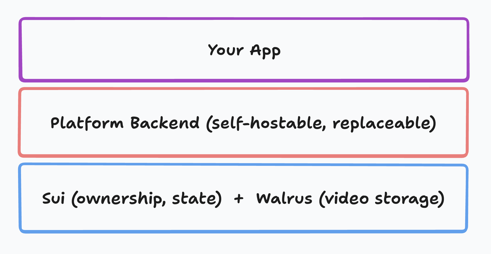

## Architecture Overview

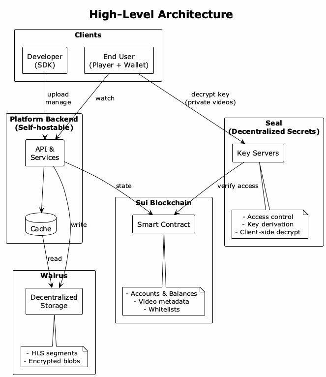

### Key Components

| Component | Role |
|-----------|------|
| **Platform Backend** | API gateway, upload handling, playback serving, caching |
| **Sui Smart Contract** | Developer accounts, balances, video metadata, whitelists |
| **Walrus Storage** | HLS segments and manifests as deletable blobs |
| **Seal Key Servers** | Access control verification, key derivation for private videos |

### Data Flow

1. **Developer** deposits SUI, gets bandwidth quota
2. **Upload**: Video → Backend → Transcode to HLS → Store on Walrus → Register on Sui
3. **Playback**: End user → Backend (cache) → Walrus → HLS stream
4. **Renewal**: Scheduled job auto-extends blobs if balance sufficient

## Key Design Decisions

| Decision | Choice | Rationale |
|----------|--------|-----------|
| Blob ownership | Developer's wallet | Simpler UX, end-users don't need wallets |
| Blob type | Deletable + auto-renewal | Content removal possible, GDPR compliant |
| Payment | SUI deposits only | Fully on-chain, no fiat complexity |
| Playback | HLS streaming | Industry standard, works everywhere |
| Bandwidth exceeded | Videos become unviewable | No credit risk, clear incentive to top up |
| Deletion | Storage resource reusable + SUI rebate | Walrus reclaims storage, Sui refunds object fees |
| Private videos | Seal + envelope encryption | True privacy, client-side decrypt, backend never sees content |
| Access control | Wallet whitelist | Developer manages allowed addresses on-chain |

## Sequence Diagrams

Detailed flows documented below. Click to expand each diagram.

<strong>1. Developer Onboarding</strong> - Registration and SUI deposit

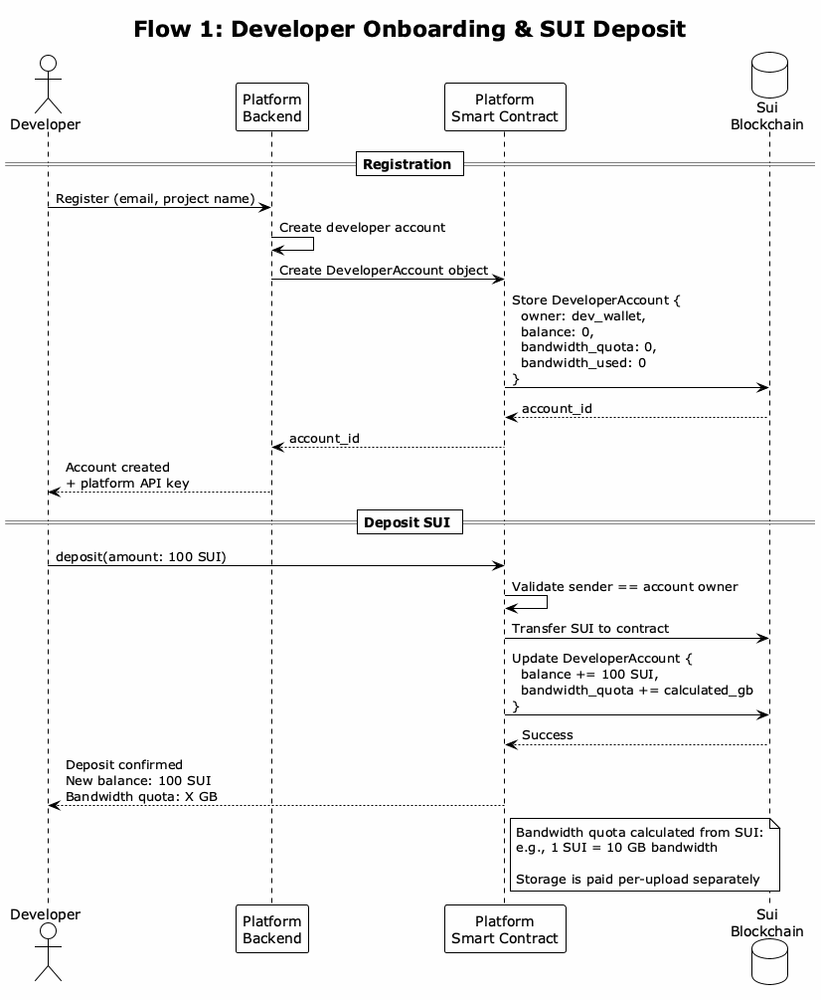

<strong>2. Video Upload</strong> - Chunked upload, HLS transcoding, Walrus storage

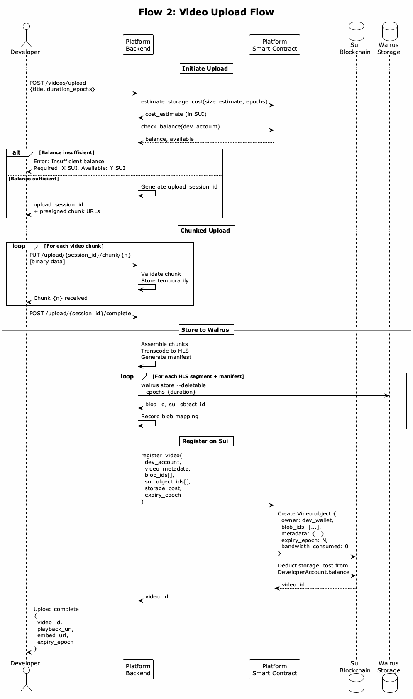

<strong>3. Video Playback</strong> - HLS streaming with caching

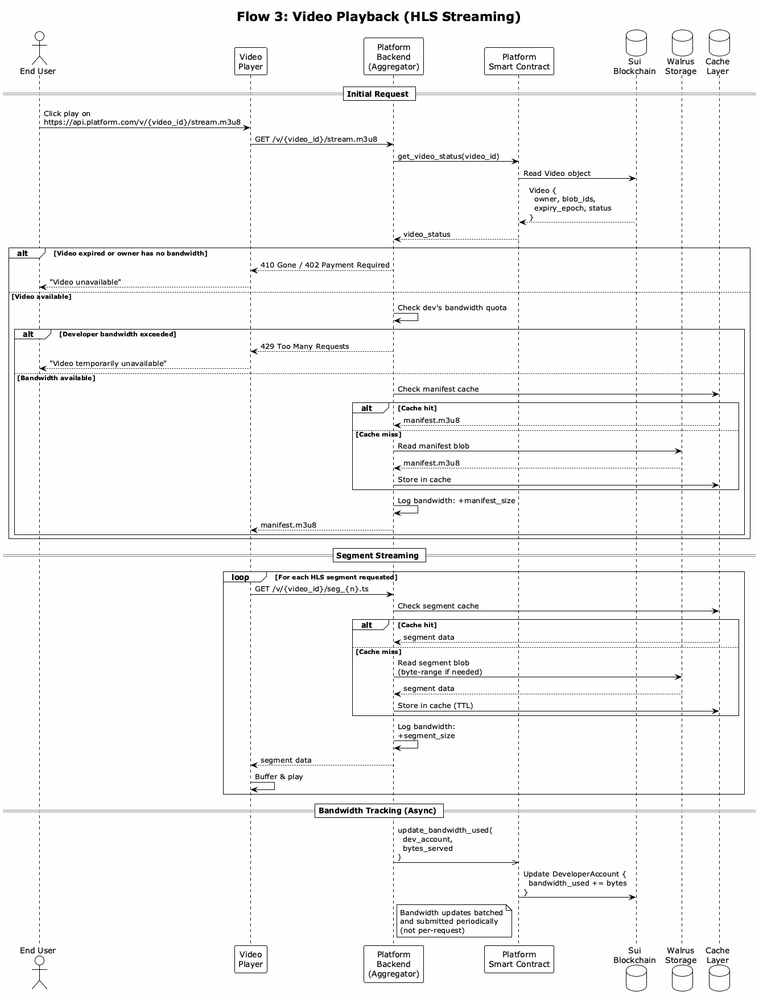

<strong>4. Auto-Renewal</strong> - Scheduled blob lifetime extension

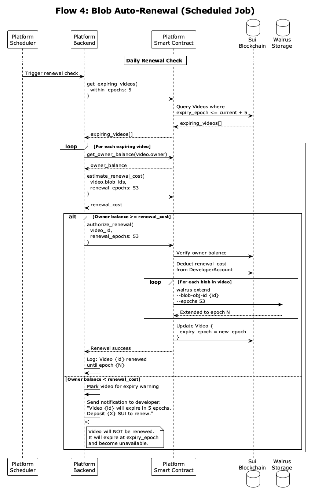

<strong>5. Video Deletion</strong> - Content removal with storage reclaim

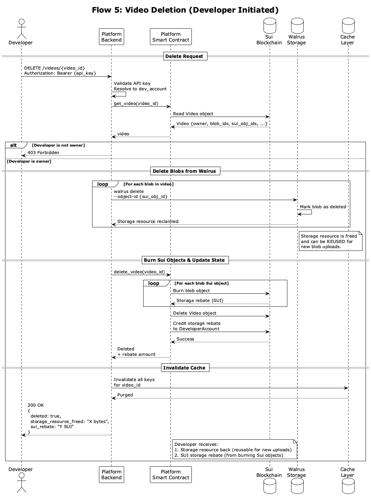

<strong>6. Bandwidth Enforcement</strong> - Quota checking and blocking

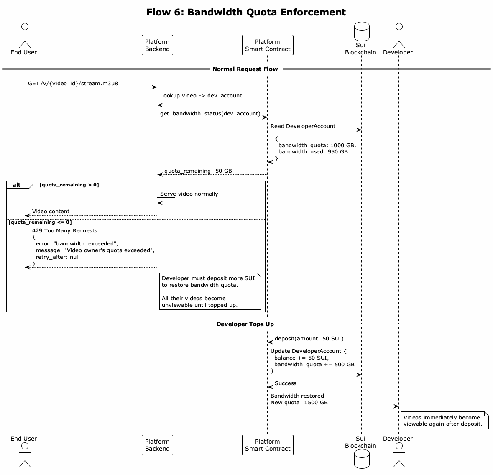

<strong>7. Embed Player</strong> - iframe and direct HLS embedding

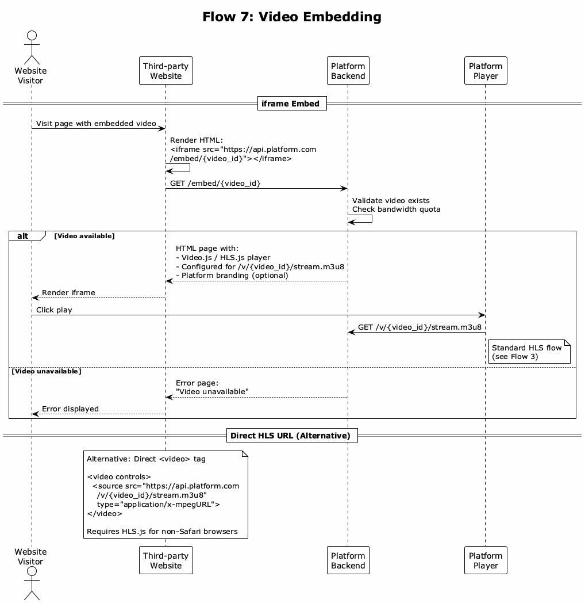

<strong>8. Private Video Upload</strong> - Seal encryption with envelope encryption

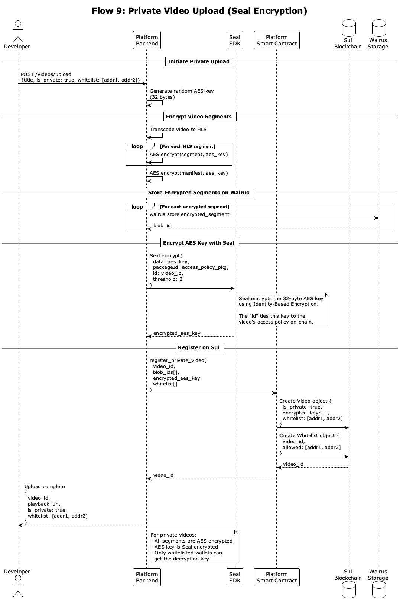

<strong>9. Private Video Playback</strong> - Client-side decryption with wallet auth

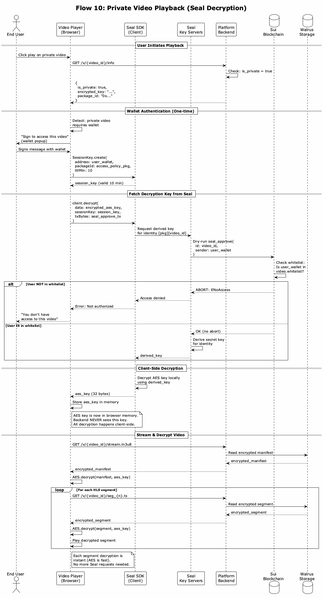

## Pricing Model

Developers pay in SUI. Costs map directly to underlying resources:

| Resource | What Developer Pays |
|----------|---------------------|
| **Storage** | Blob size × epochs (passed through from Walrus) |
| **Bandwidth** | Per GB served (from deposited balance) |
| **Renewal** | Same as storage cost (auto-deducted if balance available) |

When a video is deleted:
- Walrus storage resource is **reclaimed** (reusable for new uploads)
- Sui object storage fee is **refunded** as rebate

## Scope

### Core Features
- Developer registration & SUI deposits
- Video upload (original resolution)
- HLS playback with caching
- Bandwidth quota enforcement
- Auto-renewal of blobs
- Video deletion with storage reclaim
- Basic embed player
- Public and private videos
- Private video encryption (Seal integration)
- Wallet whitelist access control

### Future Improvements
- Multi-resolution transcoding (adaptive bitrate)
- Token-gated access (NFT/token ownership)
- Analytics dashboard
- Webhook integrations
- Custom player branding

## Deliverables

- [ ] Competitive analysis of existing video platforms (Mux, Cloudflare Stream, etc.)
- [ ] Technical architecture documentation
- [ ] Sui smart contracts (Move) - accounts, videos, whitelists
- [ ] Walrus storage integration
- [ ] Seal integration for private videos
- [ ] Upload & playback pipeline (public + private)
- [ ] Developer SDK (TypeScript)
- [ ] Reference implementation
- [ ] Documentation & open-source repository

